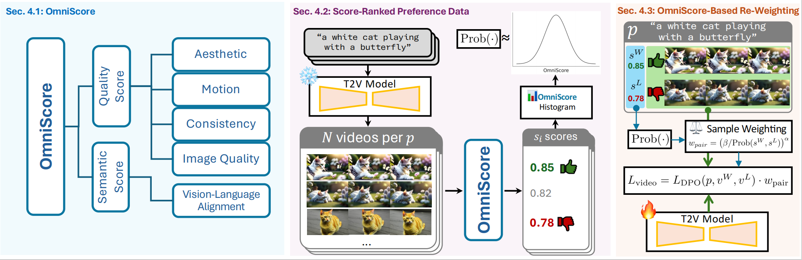

<div align="center">

<h1>VideoDPO: Omni-Preference Alignment for Video Diffusion Generation</h1>
<a href="https://arxiv.org/abs/2412.14167">
</a>
<a href="https://videodpo.github.io/">
</a>


[Runtao Liu ](https://github.com/rt219), [Haoyu Wu ](https://scholar.google.com/citations?user=kiQv84oAAAAJ&hl=zh-CN)$^{1,2 *}$ , Ziqiang Zheng $^1$, Chen Wei $^3$, [Yingqing He](https://scholar.google.com/citations?user=UDiGYN8AAAAJ&hl=en)$^1$, Renjie Pi $^1$, [Qifeng Chen](https://cqf.io/)$^1$

$^1$ HKUST $^2$ Renmin University of China $^3$ Johns Hopkins University

($^*$ Equal Contribution. Work completed during Haoyu's internship at HKUST.)


</div>


# Abstract 
<p>
Recent progress in generative diffusion models has greatly advanced text-to-video generation. While text-to-video models trained on large-scale, diverse datasets can produce varied outputs, these generations often deviate from user preferences, highlighting the need for preference alignment on pre-trained models. Although Direct Preference Optimization (DPO) has demonstrated significant improvements in language and image generation, we pioneer its adaptation to video diffusion models and propose a VideoDPO pipeline by making several key adjustments. Unlike previous image alignment methods that focus solely on either (i) visual quality or (ii) semantic alignment between text and videos, we comprehensively consider both dimensions and construct a preference score accordingly, which we term the OmniScore. We design a pipeline to automatically collect preference pair data based on the proposed OmniScore and discover that re-weighting these pairs based on the score significantly impacts overall preference alignment. Our experiments demonstrate substantial improvements in both visual quality and semantic alignment, ensuring that no preference aspect is neglected.
</p>




# News
- [2024/12/19] 🔥 We release the paper and the project. 

# TODO 
- [ ] Merge to VideoTuna
- [ ] Release videocrafter2, t2v-turbo training dataset
- [ ] Release code for cogvideox
- [x] Release code for videocrafter2 and t2v-turbo 


# Get Started 

## prepare environments 
```shell
conda create -n videodpo python=3.10 -y
conda activate videodpo
pip install -r requirements.txt
```

## prepare checkpoints
### VideoCrafter2
run following instruction to create initial checkpoints. 

```shell
mkdir -p checkpoints/vc2
wget -P checkpoints/vc2 https://huggingface.co/VideoCrafter/VideoCrafter2/resolve/main/model.ckpt
python utils/create_ref_model.py
```
### T2V-Turbo(V1)

T2V-Turbo is latent consistency model. We provide finetuning LCM based on VC2. Please download vc2 checkpoints first. And then run: 
```shell
mkdir -p checkpoints/t2v-turbo
wget -O checkpoints/t2v-turbo/unet_lora.pt "https://huggingface.co/jiachenli-ucsb/T2V-Turbo-VC2/resolve/main/unet_lora.pt?download=true"
```

## Prepare Training Data 
download vidpro-vc2-dataset.tar from the following link. 
then ln -s the dataset to /data/vidpro-dpo-dataset.
or u could also add dataset with same structure in configs/dpo/vidpro/train_data.yaml

> to reduce peak memory use in training stage, we recommend to disable validation by not providing val_data.yaml.


## Finetune VideoCrafter2
```shell
bash configs/vc_dpo/run.sh
```

## Inference VideoCrafter2
We support inference with different types of inputs and outputs.
We support both json and text formats to read prompts. 

```shell
bash script_sh/inference_t2v.sh
```
## Finetune T2V-Turbo(V1)
```shell
bash configs/t2v_turbo_dpo/run.sh
```

## Inference T2V-Turbo(V1)
```shell
bash configs/t2v_turbo_dpo/turbo_visualize.sh
```

## Helper Functions
besides, we also provide some useful tools to improve your finetuning experiences. 
We could automatically remove training logs without any checkpoints saved. 
```bash 
python utils/clean_results.py -d ./results 
```

# Citation
```
@misc{liu2024videodpoomnipreferencealignmentvideo,
      title={VideoDPO: Omni-Preference Alignment for Video Diffusion Generation}, 
      author={Runtao Liu and Haoyu Wu and Zheng Ziqiang and Chen Wei and Yingqing He and Renjie Pi and Qifeng Chen},
      year={2024},
      eprint={2412.14167},
      archivePrefix={arXiv},
      primaryClass={cs.CV},
      url={https://arxiv.org/abs/2412.14167}, 
}
```

# Acknowledgement
Our work is developed on the following open-source projects,we would like to express our sincere thanks to their contributions:
[VideoCrafter2](https://github.com/AILab-CVC/VideoCrafter),[T2V-turbo](https://t2v-turbo.github.io/),[CogvideoX](https://github.com/THUDM/CogVideo),[VideoTuna](https://github.com/VideoVerses/VideoTuna),[Vbench](https://github.com/Vchitect/VBench), [VidProM](https://vidprom.github.io/).

Thank I Chieh Chen for valuable suggesstions on demos.


# Gallery
<table class="center">
  
  <tr>
    <td style="text-align:center;" width="320">Before Alignment</td>
    <td style="text-align:center;" width="320">After Alignment</td>
  </tr>
  <tr>
    <td><a href="./assets/vc2-init/0105.gif"></a></td>
    <td><a href="./assets/vc2-dpo/0105.gif"></a></td>
  </tr>
  
  <tr>
    <td style="text-align:center;" width="320">Before Alignment</td>
    <td style="text-align:center;" width="320">After Alignment</td>
  </tr>
  <tr>
    <td><a href="./assets/vc2-init/0163.gif"></a></td>
    <td><a href="./assets/vc2-dpo/0163.gif"></a></td>
  </tr>

</table>

